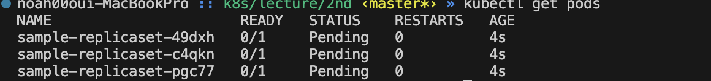

# Pod

스크립트

```
apiVersion: v1
kind: Pod
metadata:
  name: sample-pod
  namespace: default
spec:
  containers:
  - name: nginx
    image: nginx:1.27.0
    ports:
    - containerPort: 80
```


## 명령어

작성한 스크립트로 pod 실행

```
kubectl apply -f sample-pod.yml
```

현재 가동되고 있는 Pods의 목록을 보기

```vi
 kubectl get pods
```

현재 가동중인 pod를 하나 삭제

```
kubectl delete pod [pod 명]
ex) kubectl delete pod sample-pod
```

<br>

# ReplicaSet

ReplicaSet
    - Pod 를 관리하는 쿠버네티스 오브젝트가 `ReplicaSet` 이라고 함
    - Pod 하나가 다운되면 다운된 Pod를 폐기하고 동일한 새로운 Pod를 생성함

ReplocaSet 실행 스크립트

```
apiVersion: apps/v1
kind: ReplicaSet
metadata:
  name: sample-replicaset
  namespace: default
spec:
  replicas: 3
  selector:
    matchLabels:
      app: nginx
  template:
    metadata:
      labels:
        app: nginx
    spec:
      containers:
      - name: nginx
        image: nginx:1.27.0
        ports:
        - containerPort: 80
```

## 명령어

작성한 replica 스크립트 실행

```
kubectl apply -f sample-replicaset.yml
```

현재 실행중인 replicaset 목록 보기

```
kubectl get replicasets
```

생성된 ReplicaSet 삭제 명령어

```
kubectl delete replicaset [replicaset 명]
ex) kubectl delete replicaset sample-replicaset
```

실습으로 replicaset에 의해 실행된 pod를 하나 지우면 지운 즉시 다시 시행된다.

<br>

# Node

쿠버네티스 클러스터에 실제로 존재하는 서버 컴퓨터이다.

노드는 실제 물리적인 컴퓨터로써 논리적인 단위인 pod들을 프로세스와 같이 실행한다. 


<br>


# Pod의 Request와 Limit

특별한 설정이 없는 pod는 Node의 사양안에서 필요한 만큼의 자원을 유동적으로 사용한다. 이러한 이유로 다른 pod의 성능에 영향을 미치는 결과가 나온다.

이것을 해결하기 위해 request, limit을 지정하여 CPU와 memory 사용량을 조절하는 용도로 사용한다.

```
Request - Pod가 가질수 있는 최소사양
Limit - Pod가 가질수 있는 최대사양
```

작성 위치

```yml
...
spec:
  replica: 3
  ...

  template:
    ...
  
    spec:
      containers:
      - name: nginx
        image: nginx:1.27.0
        resources:      
          requests:
            cpu: "750m"           # 1 Core = 1000m 이므로 0.75 Core를 사용한다는 정의이다.
            memory: "1Gi"         # 1G -> 1000MB vs 1024MB -> 1024MB 를 정확이 명시해주기 위해 1Gi를 사용한다.
          limits:
            cpu: "750m"
            memory: "1Gi"

```

0.75 Core, 500Mi memory 의 pod를 3개 사용한다는 의미이다.

> GCP에서는 CPU 300m, Memory 500Mi의 pod 3개의 컨테이너를 가동했지만 2개만 실행됨. Node에서 설정된 CPU와 메모리가 한정적이라 자원을 정확히 분배가 가능한 pod만 실행함


<br>

# NodeGroup

노드 그룹이란 같은 역할을 하기 위해 모인 여러 개의 노드를 묶어서 부르는 용어

쿠버네티스 그룹 안에는 다양한 사양의 노드가 존재하지만 이러한 노드를 용도별로 분류헤 놓으면 관리 및 편의성을 높일 수 있음 -> 이러한 이유로 노드 그룹을 설정한다.

> GCP 에서는 `노드풀`이라고 명명함

### 실습

```yml
spec:
  replica: 3
  ...

  template:
    ...
  
    spec:
      containers:
      - name: nginx
        image: nginx:1.27.0
      nodeSelector:
        optimized_type: memory
```

GCP에 노드풀을 추가한 후, 추가된 노드풀에서 kubernetes 라벨을 추가한다. 

> key: optimized_type, value: memory

위 스크립트와 같이 `nodeSelector` 하위로 생성한 라벨을 추가한다.

ReplicaSet 삭제 후 생성 -> pods 가 실행되는지 확인

```
# replicaSet 삭제
kubectl delete replicaset sample-replicaset

# 스크립트 실행
kubectl apply -f sample-replicaset.yml

# pod 확인
kubectl get pods
```

이때, 생성하지 않은 라벨을 추가하면 아래와 같이 생성된 pod 들은 실행되지 않고 pending의 상태로 대기한다. 



정해지지 않았던 라벨을 추가하면 다시 Running 상태로 돌아온다.

지정된 라벨의 노드 그룹에서 pod가 실행되는 것을 확인할 수 있다.

## 클러스터 오토스케일링 (CA)

클라우드 서비스에서 제공하는 쿠버네티스는 오토스케일링 기능을 제공하며 노드가 부족할 떄는 스케일 아웃, 싱행되지 않는 노드가 존재할 경우 스케일 인을 하는 역할을 한다.

GCP의 GKE 경우 별다른 설정 없이 노드 풀이 `클러스터 자동 확장 처리 사용 설정` 기능을 활성화 한다면 자동으로 스케일링이 된다.

<br>

# Namespace

같은 클러스터 내에서 작업공간을 분리하기 위한 기능

namespace 생성

```
kubectl create namespace [namespace 명]
ex) kubectl create namespace new-space
```

적용

```yml
apiVersion: v1
kind: Pod
metadata:
  name: sample-pod
  namespace: new-space      # namespace 수정
spec: 
  containers: 
  - name: nginx
    image: nginx:1.27.0
    ports: 
    - containerPort: 80
```

yml 수정 후 pod 생성

```
kubectl apply -f smaple-pod.yml
```

적용된 namespace 에서 실행되는 pod 확인

```
kubectl get pods -n [namespace 명]
ex) kubectl get pods -n new-space
```

<br>

# ConfigMap과 Secet

여러 종류의 pod에 동일한 환경변수를 적용해야 한다면 ConfigMap 이나 Sceret 을 이용하여 k8s에 디런 정보를 넣어놓고 여러 오브젝트가 사용할 수 있도록 만듬

### ConfigMap과 Secret의 차이

ConfigMap과 Secret은 사용되는 원리는 같으나, 보안상 중요한 정보를 담을때는 Secret을 사용한다.

> 트러블 슈팅
>
> build 한 Dockerfile에 명시된 --platform 이 제대로 동작하지 않음
> `docker buildx build --platform=linux/amd64 -t` 를 사용하여 빌드 후 push 하니 제데로 동작함

### ConfigMap 적용 방법

- configMap yml 파일 작성
- 생성하려는 pod yml 파일에 환경변수 정보를 추가한다.

```yml
# sample-pod.yml
apiVersion: v1
kind: Pod
metadata:
  name: sample-pod
  namespace: default
spec:
  containers:
  - name: nginx
    image: asia-northeast3-docker.pkg.dev/ornate-axiom-452414-s4/kube-study-registry/configmap-sample:1.0.0
    env:              # configMap을 추가하기위한 환경변수 선언
    - name: TITLE
      valueFrom:
        configMapKeyRef: 
          name: sample-configmap
          key: PUBLIC_NAME
        
    ports:
    - containerPort: 80
```

- apply 명령어로 configMap 적용

```
kubectl apply -f sample-configmap.yml
```

- pod 생성

```
kubectl apply -f sample-pod.yml
```

- 포트 포워딩하여 환경변수가 적용됬는지 확인

```
kubectl port-forward sample-pod 8000:80
```


### Secret 작용 방법

- secret yml 작성

```yml
apiVersion: v1
kind: Secret
metadata:
  name: sample-secret
  namespace: default
data:
  SECRET_NAME: MTIzNA==   # base64로 인코딩 된 값을 넣어야 적용된다. secret이라고 해서 민감한 정보를 저장한다고 알아서 보안처리가 되는것이 아님을 유의해야한다.
```

- pod yml 파일에 추가

```yml
apiVersion: v1
kind: Pod
metadata:
  name: sample-pod
  namespace: default
spec:
  containers:
  - name: nginx
    image: asia-northeast3-docker.pkg.dev/ornate-axiom-452414-s4/kube-study-registry/configmap-sample:1.0.0
    env:          # 환경변수 추가 - secret 적용
    - name: TITLE
      valueFrom:
        secretKeyRef:
          name: sample-secret
          key: SECRET_NAME     
    ports:
    - containerPort: 80
```

- 적용은 configMap 과 동일하다

