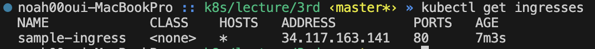

# Private Network

쿠버네티스 클러스터 안에 있는 Pod들은 private network와 같이 취급된다. pod는 일반적으로 외부와의 격리가 필요하기 때문에 private network를 가진다.

# 로드밸런서 란

하나의 주소로 접속했을때 알아서 적절히 분산되어 연결하게 하는것을 부하 분산, 로드 벨런싱이라고 한다.

로드 밸런서의 종류는 크게 L4 로드 밸런서와 L7 로드 밸런서가 있다.

> L7 로드 밸런서는 OSI 7계층에서 응용계층, L4 로드 밸런서는 전송계층에 속한다.
> L4 로드 밸런서는 기계적으로 로드밸런싱이 이루어지기 떄문에 빠르게 동작할 수 있으며, L7의 제약을 받지 않기 떄문에(?) HTTP 이외의 프로토콜을 사용하는 서비스에도 적용이 가능하다.

<br>

# 기초적인 로드밸런싱을 위한 Service 개념

`service`는 코버네티스에서 L4 로드 밸런서와 같은 역할을 하는 오브젝트

여러 pod를 연결하여 하나의 주소로 접속하면 적절히 부하 분산을 하도록 만들수 있음

service는 기본적으로 내부 네트워크에 존재하는 디바이스이지만, 부가 기능이 추가된 타입들도 준재함
- ClusterIp: 가장 기본적인 형태의 Service이다. Service 오브젝트는 내부 네트워크에 IP 주소를 할당 받는다. `(실무에서 가장 많이 사용하는 방식)`
- NodePort: 쿠버네티스 크러스터 내의 모든 Node의 특징 포트와 해당 Service를 연결한다. `(테스트 환경에서 많이 사용한다.)`
- LoadBalancer: 클라우드 서비스에서 제공하는 L4 로드 밸런서와 Service를 연결한다.
- ExternalName: 외부에 있는 개체를 DNS 주소로 매핑하여 클러스터 내부의 오브젝트가 접근할 수 있도록 돕는 용도로 Service를 활용한다.


<br>

# Service 실습

```yml
apiVersion: v1
kind: Service
metadata:
  name: sample-service
  namespace: default
spec:
  selector:                 # replicaset 과 동일하게 selector 를 사용한다.
    app: nginx
  ports:
    - protocol: TCP         # TCP 통신을 명시한다.
      port: 80              # service의 port
      targetPort: 80        # 연결되는 pod의 port -> replica의 container에서 설정된 port를 말하는것
```

service 적용 명령어

```
kubectl apply -f [yml 명]

ex) kubectl apply -f sample-service.yml
```

생성된 service 확인

```
kubectl get services
```

로트 포워딩으로 생성된 service 를 로컬 클라이언트와 연결하는 명령어

```
kubectl port-forward service/[service 명] [host port]:[service port]

ex) kubectl port-forward service/sample-service 8080:80
```


### NodePort

외부에서 서비스에 바로 접속할 수 있도록 함 (기존에는 port-forward 형태로 접속할 수 있게 만들어줚음)

```yml
apiVersion: v1
kind: Service
metadata:
  name: sample-service
  namespace: default
spec:
  type: NodePort            # NodePort 명시함, 없으면 ClusterIp 가 기본값임
  selector:
    app: nginx
  ports:
    - protocol: TCP
      port: 80
      targetPort: 80
      nodePort: 30001       # 연결될 Port
```

방화벽을 열어야 접속할 수 있음

GCP는 아래의 명령어를 입력하여 방화벽을 개방함

```
gcloud compute firewall-rules create nodeport-study-allow-port --allow=tcp:30001
```


<br>

# Service의 한계

전송계층인 L4 역할을 하는 `services`는 웹서비스를 운영 함에 있어서는 아래와 같인 이류로 부족할 수 있다.

1. 접속하는 경로마다 다른 서비스로 연결하고 싶은 경우
  - path에 따른 트래픽의 분산이 제한됨
    - /community 경로에 접속하는 트래픽을 커뮤니티 관련 서비스로 라우팅하는 기능이 제한됨
  - service는 L4 로드 벨런서를 사용하는 전송계층에서 동작하며 주로 IP 주소와 포트 번호를 기준으로 트래픽을 분산하기 때문에 복잡한 라우팅이 필요할 때는 제한적일 수 있다.
2. SSL 을 적용하고 싶은 경우
3. 복잡한 보안설정이 필요한 경우

이러한 문제는 `Ingress`에서 웹서버 미들웨어를 바탕으로 해결이 가능하다.

<br>

# Ingress 실습

aws는 필요한 것들은 강의 노트를 보고 따라하자

> 내가 한 설정들 (GCP를 사용했음)

helm 설치

```
brew install helm
```

ingress script 작성

```yml
apiVersion: networking.k8s.io/v1
kind: Ingress
metadata:
  name: sample-ingress
  namespace: default
  annotations:
    alb.ingress.kubernetes.io/scheme: internet-facing
    alb.ingress.kubernetes.io/target-type: ip
spec:
  # ingressClassName: alb     # aws 설정이다. gcp에서는 명시하지 않아도 됨
  rules:
    - http:
        paths:
        - path: /
          pathType: Prefix          # path에 대한 설정. 각 paht에 대한 정의가 가능하다.
          backend:
            service:
              name: sample-service
              port:
                number: 80
        - path: /v1/admin                # /admin 으로 path 설정하여 사용가능
          pathType: Prefix               # prefix 외에 exact, ImplementationSpecific 으로 사용가능
          backend:
            service:
              name: sample-service       # 이전에 생성한 service. ingress 는 service의 프록시 서버 역할을 한다.
              port:
                number: 80
```

[pathType 공식문서](https://kubernetes.io/docs/concepts/services-networking/ingress/#path-types) 로 정확한 사용법을 확인하자

ingress script 적용 명령어

```
kubectl apply -f sample-ingress.yml
```

ingress 생성 확인

```
kubectl get ingresses
```



address의 주소로 접속

> ingress 를 생성하면 address가 공백일 수 있음. 시간이 지나면 생성되지만 address가 생성되지 않는다면 트러블 슈팅 필요


