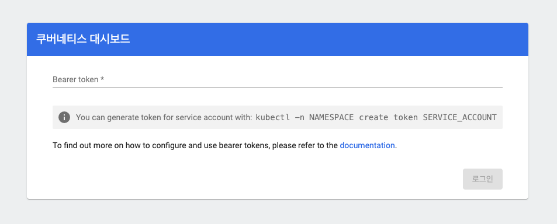

# 쿠버네티스의 패키지, Helm

오브젝트의 중복된 부분을 하나로 묶어서, 변수 몇 개만 설정하면 오브젝트를 구성할 수 있도록 하는 쿠버네티스의 보조 도구이다.

### Helm 차트 

Helm 차트는 Helm에서 다루는 패키지를 이르는 말이다.

Helm의 구조는 아래와 같다.

|              |                                                       |
| ------------ | ----------------------------------------------------- |
| Chart.yml    | 해당 Helm 차트에 대한 기본적인 정보                   |
| template.yml | 오브젝트들의 공통된 내용을 정의해두는 디렉토리        |
| values.yml   | 차트에서 사용하는 변수들의 기본값이 설정되어있는 파일 |

Helm 차트도 다른 도구의 페키지 매니저와 같이 의존성을 설정할 수 있는데, 이때는 아래와 같은 요소가 추가로 필요하게 된다.

- charts
  - 외부에서 가져온 의존성 데이터가 실제로 담겨있는 디렉토리
  - Gradle의 dependencies, NodeJs의 node_modules와 비슷하다.

### Helm 주요 명령어

|                                                                           |                                                                                                                                 |
| ------------------------------------------------------------------------- | ------------------------------------------------------------------------------------------------------------------------------- |
| helm repo add [repository 명] [주소]                                      | 특정 주소의 레포지토리에 있는 Helm 차트를 내 컴퓨터로 불러온다. <br> (레포지토리란 Helm 차트를 모아놓은 공간이라고 생각하면 됨) |
| helm install [Helm 릴리즈 명] [Helm 차트 주소] -f [values.yaml 파일 경로] | Helm 차트를 내 쿠버네티스 클러스터에 설치한다. <br> 릴리즈란 Helm 차트가 설치된 단위를 나타내는 객체이다.                       |
| helm list                                                                 | 쿠버네티스 클러스터 내에 설치된 helm 릴리즈 목록을 조회한다.                                                                    |
| helm uninstall [Helm 릴리즈명]                                            | Helm 릴리즈를 삭제한다.                                                                                                         |
| helm upgrade [Helm 릴리즈명] -f [values.yaml 파일 경로]                   | 설치된 Helm 릴리즈를 수정한다.                                                                                                  |
| helm rollback [RELEASE] [REVISION]                                        | 이전의 특정 릴리스 상태로 애플리케이션을 되돌리는 데 사용                                                                       |


### 실습

kubernetes-dashboard 사용해보자

[artifacthub/kubernetes-dashboard](ttps://artifacthub.io/packages/helm/k8s-dashboard/kubernetes-dashboard) 접속하여 명령어 확인

순차적으로 명령어 실행

> helm 설치는 기본이다.

```
# Add kubernetes-dashboard repository
helm repo add kubernetes-dashboard https://kubernetes.github.io/dashboard/
# Deploy a Helm Release named "kubernetes-dashboard" using the kubernetes-dashboard chart
helm upgrade --install kubernetes-dashboard kubernetes-dashboard/kubernetes-dashboard --create-namespace --namespace kubernetes-dashboard
```

포트 포워딩하자

```
kubectl -n kubernetes-dashboard port-forward svc/kubernetes-dashboard-kong-proxy 8443:443
```

포트 포워딩시 트러블 슈팅

아래 pod 에서 계속 에러남

```
kubernetes-dashboard-kong-678c76c548-8g8xr              0/1     CrashLoopBackOff   6 (24s ago)   6m25s
```

아래 명령어로 amin ui를 disable 가 추가된 명령어를 다시 실행

```
helm upgrade --install kubernetes-dashboard kubernetes-dashboard/kubernetes-dashboard --create-namespace --namespace kubernetes-dashboard --set kong.admin.tls.enabled=false
```

https://localhost:8443 포트로 열었으니 접속해본다.




API Bearer Token을 입력해야 하는 인풋이 나옴. 해당하는 token은 service account 를 생성하여 발급 받아야 한다.

> Kubernetes에서 서비스 어카운트(Service Account)는 포드(Pod)가 Kubernetes API와 상호 작용할 때 사용하는 계정. <br>서비스 어카운트는 특정 네임스페이스에 속하며, 기본적으로 각 네임스페이스에는 자동으로 생성되는 기본 서비스 어카운트가 존재한다.
>
> 서비스 어카운트의 기능과 용도는 아래와 같다.
>
> 1. API 접근 권한 제어
> 2. 보안 및 최소 권한 원칙
> 3. 자동화된 관리


### service account 생성 및 권한을 부여하자

service account 생성 명령어

```
kubectl create serviceaccount dashboard-admin-sa -n kube-system
```

셍성한 service account 에 권한 부여한다.

```
kubectl create clusterrolebinding dashboard-admin-sa --clusterrole=cluster-admin --serviceaccount=kube-system:dashboard-admin-sa
```

### Token 생성

```
kubectl create token [service account 명] -n [namespace 명]
ex) kubectl create token dashboard-admin-sa -n kube-system

# JWT token 생성됨
> eyJhbGciOiJSUzI1NiIsImtpZCI6Ikg...
```